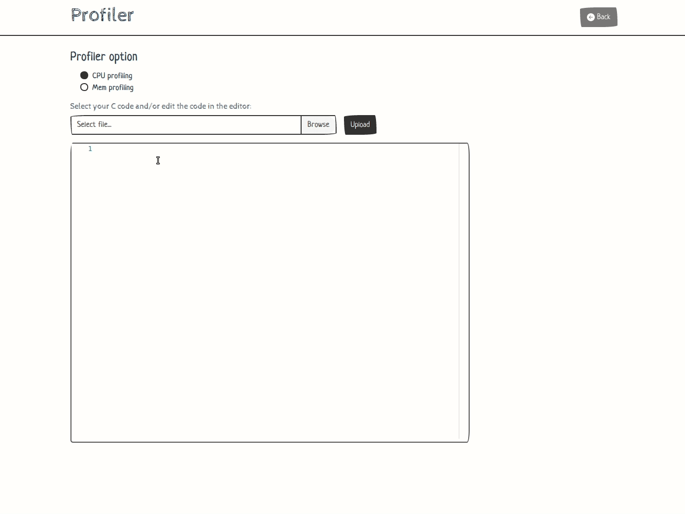

# CMU Interactive Data Science Final Project

* **Title**: Profiler
* **Online URL**: https://cmu-ids-2020.github.io/fp-profiler/ (Static demo without real back-end and call-graph support. Try it locally to see full functionality.)
* **Team members**:
  * Contact person: haonanw@andrew.cmu.edu
  * weiyizha@andrew.cmu.edu
  * lichenj@andrew.cmu.edu
  * yijiez2@andrew.cmu.edu
* **Track**: Interactive Visualization/Application
* **Video**: [here](https://drive.google.com/file/d/1HSFbZOKvZXDsIAktT9s-t5HH797ZDeJY/view?usp=sharing)



## Work distribution

Haonan Wang:

Weiyi Zhang:

Lichen Jin:

Yijie Zhang: Front-end setup, user interface design and implementation.

## Deliverables

### Proposal

- [x] The URL at the top of this readme needs to point to your application online. It should also list the names of the team members.
- [x] A completed proposal. The contact should submit it as a PDF on Canvas.

### Design review

- [x] Develop a prototype of your project.
- [x] Create a 5 minute video to demonstrate your project and lists any question you have for the course staff. The contact should submit the video on Canvas.

### Final deliverables

- [x] All code for the project should be in the repo.
- [x] A 5 minute video demonstration.
- [x] Update Readme according to Canvas instructions.
- [x] A detailed project report. The contact should submit the video and report as a PDF on Canvas.

### Project setup

The project consists of one back-end and one front-end. You can start a back-end under `backend/` with the following command:
```
flask run
```
This will start a dev server for back-end at localhost:5000.

You can start a front-end under `frontend/profiler/` with the following command:
```
npm install # install all dependencies locally
npm run serve
```
This will start a dev server for this application (front-end) at localhost:8080.

